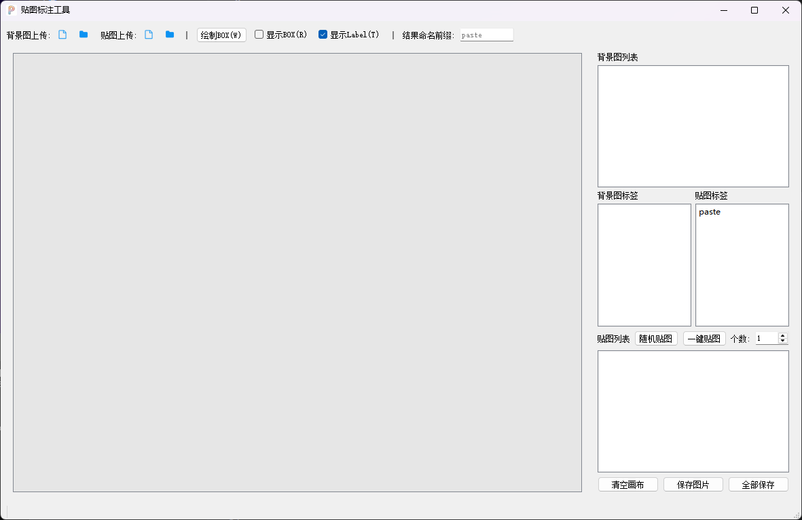

# PasteLabel 图像编辑器

PasteLabel 是一个简单的图像编辑器，在hbb标注的基础上增加了贴图标注的功能，解决样本采集困难问题。



## 功能特点

### 核心功能
- **背景图片管理**：支持加载和切换背景图片
- **贴图功能**：可从文件夹加载小图片并粘贴到背景图片上
- **标签管理**：为背景图片和贴图添加、删除标签
- **检测框**：支持在背景图片上绘制检测框并添加标签
- **JSON 保存**：自动将标签和检测框信息保存为 JSON 文件
- **随机贴图**：点击工具栏的「随机贴图」按钮，随机在背景图片上添加贴图
- **一键贴图**：从当前图片开始完成后续图片的随机贴图

## 快捷键

| 快捷键 | 功能 |
|--------|------|
| A | 切换到上一张背景图 |
| D | 切换到下一张背景图 |
| R | 切换检测框显示/隐藏状态 |
| T | 切换类别名显示/隐藏状态 |
| W | 进入绘制检测框模式 |
| Q | 退出绘制模式 |
| Delete/E | 删除选中的检测框 |

## 使用说明

### 基本操作
1. **加载背景图片**：点击工具栏的「打开背景图文件夹」按钮
2. **加载贴图**：点击工具栏的「打开贴图文件夹」按钮
3. **添加贴图**：从右侧贴图列表中选择贴图，默认到背景图片左上角
4. **调整贴图**：使用鼠标拖动调整位置，右键拖动调整大小
5. **贴图标签**：点击贴图标签列表中的标签，可修改贴图类别
6. **添加标签**：右键点击标签列表，选择「增加标签」
7. **删除标签**：在标签列表中选择标签，右键点击选择「删除标签」

### 检测框操作
1. **进入检测框模式**：按 W 键或点击上侧面板的「绘制BOX(W)」按钮
2. **绘制检测框**：在背景图片上拖动鼠标绘制矩形检测框
3. **设置检测框标签**：绘制完成后，在弹出的对话框中选择或输入标签
4. **调整检测框**：使用鼠标拖动调整位置，右键拖动调整大小
5. **删除检测框**：选中检测框后按 Delete 键或 E 键
6. **退出绘制模式**：按 Q 键

## 系统要求

- Windows 操作系统
- Python 3.7+
- PyQt5
- OpenCV (cv2)

## 安装与运行

1. 安装依赖：
   ```bash
   pip install PyQt5 opencv-python
   ```

2. 运行程序：
   ```bash
   python image_editor.py
   ```

## 注意事项

- 标签删除操作会同时从所有背景图片的检测框中移除该标签
- 标签标注功能和贴图功能是独立的，互不干扰

---

© 2026