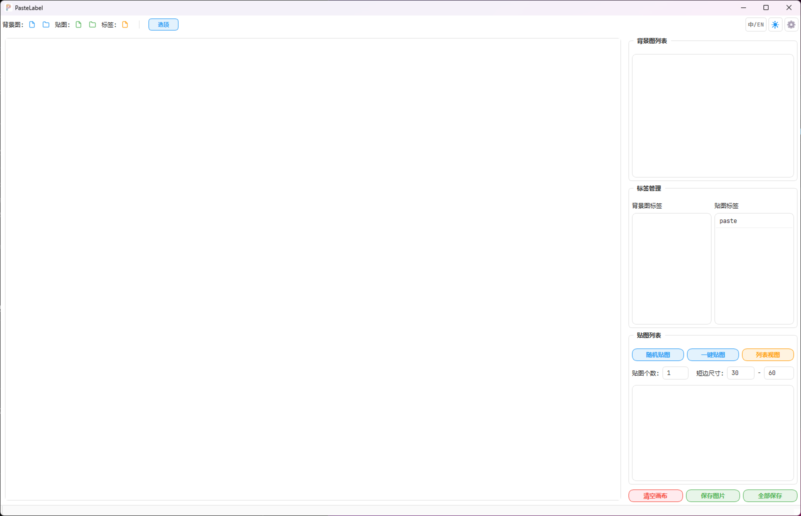

# PasteLabel

PasteLabel 是一个基于 PyQt5 的图像标注工具，支持**贴图**（合成）和**检测框**（LabelMe 格式）标注，有效解决样本采集困难的问题。



---

## 支持平台

**Windows 10+** · **Linux (x86_64)**

> 可使用 `PasteY/build.sh` 在对应平台自行构建。

📖 详细使用教程请参阅 [用户指南](./user_guide.md)

## 功能特性

- 🎨 **深色/浅色主题** - 一键切换深色和浅色主题
- 🌐 **中英文切换** - 支持中文和英文界面
- ⚙️ **快捷键自定义** - 可在设置中修改所有快捷键
- 🖼️ **贴图标注** - 支持随机/批量放置贴图
- 📦 **检测框标注** - LabelMe 格式 JSON 输出
- 🎯 **智能放置** - 中心点避让算法避免贴图重叠
- 📁 **批量处理** - 一键处理所有图片

## 源码运行

### 依赖库

```bash
pip install PyQt5 opencv-python
```

### 运行

```bash
python PasteY/main.py
```

## 项目结构

```
PasteLabel/
├── PasteY/                    # 模块化代码包
│   ├── main.py                # 程序入口
│   ├── __init__.py            # 包初始化
│   ├── canvas/                # 画布模块
│   │   ├── canvas.py          # 画布控件
│   │   ├── canvas_renderer.py # 画布绘制
│   │   ├── canvas_interaction.py # 画布交互（拖拽、缩放）
│   │   ├── canvas_drawing.py  # 检测框绘制逻辑
│   │   └── canvas_menu.py     # 右键菜单
│   ├── ui/                    # 界面模块
│   │   ├── main_window.py     # 主窗口逻辑
│   │   ├── ui_builder.py      # UI 构建
│   │   ├── widgets.py         # 自定义控件
│   │   ├── dialogs.py         # 对话框
│   │   ├── settings_dialog.py # 设置对话框
│   │   ├── theme.py           # 主题管理（深色/浅色）
│   │   ├── i18n.py            # 中英文切换
│   │   ├── styles.py          # 样式管理
│   │   ├── title_bar.py       # 标题栏
│   │   └── dwm.py             # Windows DWM API
│   ├── engine/                # 业务逻辑模块
│   │   ├── paste_engine.py    # 贴图引擎（随机/批量放置）
│   │   ├── image_loader.py    # 图片加载
│   │   ├── label_manager.py   # 标签管理
│   │   ├── save_manager.py    # 保存管理
│   │   ├── undo_manager.py    # 撤销/重做
│   │   └── event_handler.py   # 事件处理
│   ├── core/                  # 核心配置模块
│   │   ├── config.py          # 配置常量
│   │   ├── config_manager.py  # 配置管理器
│   │   ├── utils.py           # 工具函数
│   │   ├── models.py          # 数据模型
│   │   ├── editor_protocol.py # 编辑器接口
│   │   └── exception_hook.py  # 全局异常捕获
│   ├── tests/                 # 单元测试
│   ├── build.sh               # 构建脚本
│   └── PasteLabel.spec        # PyInstaller 配置
├── PasteX/                    # 旧版单文件版本
├── images/                    # 样本图片数据
├── ico_image/                 # 图标资源
│   └── fonts/                 # JetBrains Mono 字体
├── paste_label.txt            # 贴图标签文件
├── conftest.py                # pytest 配置
├── README.md                  # 项目说明
├── user_guide.md              # 用户指南
├── LICENSE                    # MIT 许可证
└── .gitignore
```

## 快捷键

| 快捷键 | 功能 |
|--------|------|
| `A` / `D` | 上/下一张背景图 |
| `W` | 进入绘制检测框模式 |
| `Q` | 退出绘制模式 |
| `R` | 切换检测框显示 |
| `T` | 切换标签显示 |
| `F` | 切换贴图名显示 |
| `G` | 切换自动保存 |
| `Ctrl+G` | 切换网格显示 |
| `Delete` | 删除选中项 |
| `Ctrl+Z` | 撤销 |
| `Ctrl+Y` | 重做 |

> 所有快捷键可在设置对话框中自定义修改

## 测试

```bash
# 安装测试依赖
pip install pytest

# 运行测试
pytest PasteY/tests/ -v
```

## 许可证

遵循MIT

Copyright © 2026 Zomcxj
