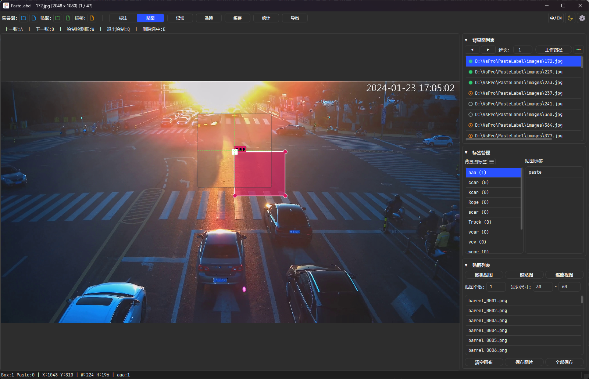
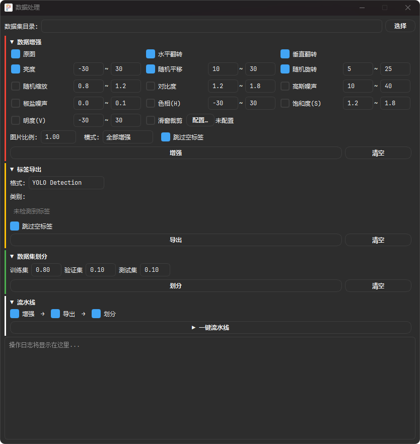

# PasteLabel

PasteLabel 是一个基于 PyQt5 的图像标注工具，支持**贴图合成**和**多类型标注**（水平框 / 分割多边形 / 关键点 / 旋转框，LabelMe 格式），有效解决样本采集困难的问题。

| 界面展示 | 数据处理 |
|:---:|:---:|
|  |  |

---

## 支持平台

**Windows 10+** · **Linux (x86_64)**

## 功能特性

### 核心标注
- **贴图合成** — 单张/批量放置贴图，支持随机避让算法放置
- **语义区域放置** — 在画布上绘制语义区域（矩形/多边形），随机贴图时贴图完整落在区域内，使合成样本符合画面语义
- **标注质检** — 一键扫描数据集，报告越界框/超小框/重复框/异类重叠/近似名/分组不一致等问题，支持双击跳图、右键忽略、右键删除异类重叠框
- **多类型标注** — 水平检测框、分割多边形、姿态关键点、旋转框（OBB），LabelMe 格式 JSON 输出，16 色自动分配
- **分组标注** — 关键点等形状可分配 `group_id`，标签列表显示 `label [分组号]`，支持按任务 / 按分组筛选
- **贴图/标注模式切换** — 切换鼠标交互优先级（悬停高亮 + 点击优先级反转）
- **标签管理** — 全局标签列表，支持增删改，级联更新所有图片 JSON
- **背景标签导入** — 从文本文件批量导入背景图标签，与 JSON 扫描结果取并集，互不覆盖

### 图片管理
- **工作/移除路径** — 移除图片到 `_delete_` 文件夹，支持恢复
- **大数据集加载** — 数千张图片的列表快速填充，标注状态图标逐行点亮，加载过程界面保持响应
- **列表路径显示** — 可切换背景图列表显示相对路径（以加载文件夹的父目录为基准），右键可复制图片全局路径
- **拖拽操作** — 拖入图片/JSON 上传，拖出画布复制文件
- **记忆** — 自动记录最近 10 组背景图/贴图/标签路径组合，保存工作状态
- **自动保存** — 切图时静默保存合成图 + JSON

### 编辑能力
- **网格辅助线** — 可调间距/线宽/透明度，深色主题下自动适配
- **背景缩放** — 滚轮缩放（0.5x ~ 3.0x），Ctrl+F 适应视图
- **标注十字线** — 标注模式下背景图显示后出现，可调粗细、透明度与颜色
- **右键菜单** — 画布/贴图/检测框各有独立右键操作

### 数据处理
- **数据增强** — 支持 12 种图像变换（水平翻转、垂直翻转、亮度、对比度、色相、饱和度、明度、高斯噪声、椒盐噪声、随机平移、随机旋转、随机缩放），可配置参数范围，支持"全部增强"和"随机几项"模式，可调图片比例（0.05~1.0）；增强时同步保留形状类型/顶点/分组信息
- **多格式导出** — LabelMe JSON 转 YOLO / VOC (XML) / COCO (JSON)，YOLO 支持检测框 / 分割 / 关键点 / 旋转框四种任务；支持选择导出标签类别、跳过空标签、自动检测增强后图片；不同形状类型混标时按任务提示跳过或报错
- **格式转换** — 独立窗口支持 LabelMe / YOLO / COCO / Pascal VOC 相互转换，可选任务类型（检测框 / 分割 / 旋转框 / 关键点），默认 LabelMe → YOLO
- **画布显示调节** — 实时调整标注透明度、图像亮度、对比度，支持一键复位
- **数据集划分** — 按 train/val/test 比例划分到 divide/ 目录，默认 0.8/0.1/0.1
- **KMeans 划分** — 基于标签出现频次+检测框面积的二维特征做聚类，自动用轮廓系数推荐最优 K 值，支持用户手动调整；输出目录结构 `g{组号}/images/{train,val}` + `g{组号}/labels/{train,val}`，每组分配合适的 classes.txt 与 yaml
- **一键流水线** — 增强→导出→划分一键串联执行
- **中断/清空** — 每步支持中断操作和清空输出文件
- **自动输出目录** — 在数据目录的父目录下自动创建 exports/ 子目录

### 界面体验
- **深色/浅色主题** — 一键切换，DWM API 同步 Windows 标题栏
- **中英文切换** — 全界面 + 弹窗按钮同步本地化
- **快捷键自定义** — 设置中列出的动作和缓存槽快捷键可修改
- **快捷键删除标签** — 选中标签后按 `Ctrl+Shift+Z` 直接删除，无需右键确认
- **一键恢复默认设置** — 设置窗口左下角可一键清除全部自定义配置并还原出厂默认
- **命令行启动** — 支持 `PasteLabel.exe [目录] [--labels 文件]` 直接打开指定目录并导入标签
- **标签统计** — 实时统计背景图标签/贴图标签数量，支持颜色替换，颜色按钮显示当前 HTML色值
- **数据集健康** — 标签统计弹窗内嵌诊断区，展示类别分布 / 尺寸直方图 / 长宽比分布 / IoU 重叠分布 / 贴图 vs 标注对比，并自动给出「该多合成哪类」的文字建议
- **独立滚轮缩放步长** — 检测框缩放步长只控制检测框滚轮缩放，贴图缩放步长只控制贴图滚轮缩放
- **全局异常捕获** — 未处理异常和 Qt 消息自动写入 `~/pastelabel.log`（与 `~/.pastelabel.json` 同目录）

---

## 项目特色

- **贴图合成** — 单张或批量放置贴图，并支持随机避让，快速生成合成样本
- **多类型标注** — 水平框、分割多边形、姿态关键点、旋转框（OBB）统一存储于 LabelMe JSON，可导出 YOLO 检测/分割/姿态/旋转框格式
- **工作路径记忆** — 自动保存最近 10 组背景图、贴图和标签路径组合，便于恢复工作状态
- **检测框缓存** — 3 个持久化缓存槽，支持锁定、改名和自定义快捷键；`Ctrl+C` 复制、`Ctrl+V` 粘贴当前槽，默认 `1`/`2`/`3` 粘贴对应槽
- **放大器窗口** — 标注模式下鼠标周围实时显示放大预览区域（可调节缩放倍率 + 侧边/跟随鼠标两种位置模式），精准定位检测框边界
- **数据流水线** — 支持 12 种图像变换的数据增强、多任务格式导出、train/val/test 自动划分，一键串联执行

---

## 源码运行

### 依赖

```bash
pip install -r requirements.txt
```

Windows 深色标题栏依赖 `ffi.dll`。使用 `conda` 环境时，该文件通常在：

```text
<conda_env>/Library/bin/ffi.dll
```

### 运行

```bash
python pastelabel/main.py
```

## 文档导航

- [用户使用指南](./docs/user_guide.md)
- [设置说明（快捷键与参数）](./docs/settings_guide.md)
- [项目结构说明](./docs/project_structure.md)

## 构建可执行文件

### 使用 build.sh（推荐）

```bash
bash build.sh
```

自动检测平台，调用 PyInstaller 打包为单文件 exe，输出 `dist/PasteLabel.exe`。Windows 下自动处理 ffi.dll 依赖。

### 使用 spec 文件（手动）

```bash
pyinstaller pastelabel/PasteLabel.spec
```

输出 `dist/PasteLabel.exe`。需确保已安装全部依赖并手动处理 ffi.dll。

---

## 测试

```bash
pip install -r requirements-dev.txt
pytest tests/ -v
```

## 许可证

MIT License

Copyright (c) 2026 Zomcxj

参考项目：[X-AnyLabeling](https://github.com/CVHub520/X-AnyLabeling)
